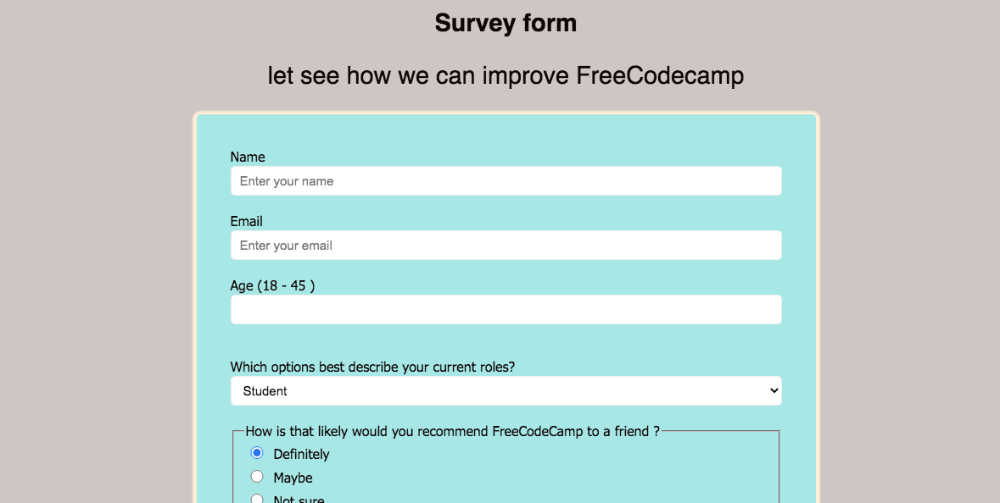

# Freecodecamp challenge Survey form

<<<<<<< HEAD
 ## Screenshot
=======
This project and code written is built for choose to hone my skills in frontend development. Subsequently, I will be implementing more features, collecting data from users for functionalities.

## Screenshot
>>>>>>> ddea74e042077aea2fa1a46a030bd15d9caa6f3f
 

## Built with

- HTML
- CSS

## Links

[live Demo](https://brymmobaggins.github.io/freecodecamp-survey-form/)
